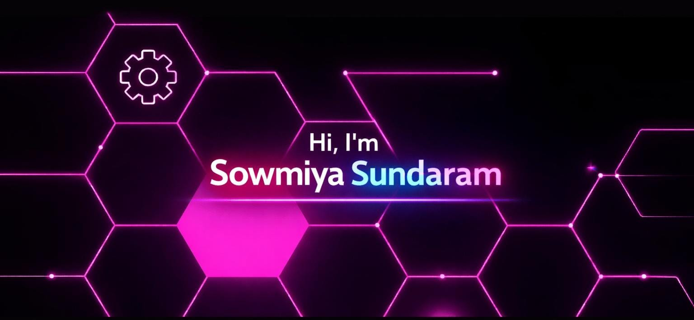

<!-- Header Section -->

  

<!-- Header Section -->

<!-- Typing Animation -->

  

<!-- About Me -->
<h3 align="center">
  A passionate Full Stack Developer and 3rd-year CSBS student who loves building scalable web and mobile applications.  
  I enjoy solving DSA problems, exploring new technologies, and improving my problem-solving skills daily!
</h3>

---

<!-- Tech Stack -->
<h2 align="center"> Tech Stack</h2>

<table align="center">
  <tr>
    <td align="center" width="50%">
      <h3>💻 Frontend</h3>
      

        
        
        
        
        
      

    </td>
    <td align="center" width="50%">
      <h3>⚙️ Backend</h3>
      

        
        
        
        
      

    </td>
  </tr>
  <tr>
    <td align="center" width="50%">
      <h3>🗄️ Databases</h3>
      

        
        
        
      

    </td>
    <td align="center" width="50%">
      <h3>🧰 Tools & Platforms</h3>
      

        
        
        
        
        
      

    </td>
  </tr>
</table>

---

<!-- Currently Learning -->
<h2> Currently Learning</h2>
<ul>
  <li>Advanced <b>Spring Boot</b> and RESTful APIs for scalable applications.</li>
  <li><b>React Hooks</b>, Context API, and component design patterns.</li>
  <li><b>System Design</b> fundamentals and scalable architecture concepts.</li>
  <li><b>MySQL</b> performance tuning and optimization.</li>
  <li>Solving DSA problems on <b>LeetCode</b> and <b>CodeChef</b> consistently.</li>
</ul>

---

<!-- Achievements -->
<h2> Achievements</h2>
<ul>
  <li> Solved <b>150+ DSA problems</b>.</li>
  <li> Maintained a strong <b>GitHub streak</b> with daily contributions.</li>
  <li> Built multiple full-stack projects using React + Firebase + Spring Boot.</li>
</ul>

<h2>Featured Projects</h2>

<ul>
    <li>
        <b><a href="https://github.com/srsowmiya/netflix-clone" target="_blank">
        Netflix Clone with AI-Based Mood Recommender</a></b>
        

        A streaming platform clone enhanced with an AI-based mood detection system to recommend movies and series based on user emotions.
        

    </li>
    <li>
        <b><a href="https://github.com/srsowmiya/URLShortener" target="_blank">
        URL Shortener</a></b>
        

        A backend-driven URL shortening service built using Node.js and MongoDB with redirection and link management features.
        

    </li>
    <li>
        <b><a href="https://github.com/srsowmiya/hospital-management-system" target="_blank">
        Hospital Management System</a></b>
        

        A system for managing patient records and appointments efficiently.
        

    </li>
    <li>
        <b><a href="https://github.com/srsowmiya/auction-platform" target="_blank">
        Auction Platform</a></b>
        

        An online bidding system built using Spring Boot and React with real-time bidding and winner selection.
        

    </li>
</ul>

<!-- GitHub Stats -->
<h2 align="center">📊 GitHub Stats</h2>

  
  

<!-- LeetCode Stats -->

 

---

<!-- Connect Section -->
<h2>🌐 Connect with me:</h2>

  
  
  
  

---

<!-- Footer -->

✨ Thanks for visiting my profile! Keep coding and exploring 💻

